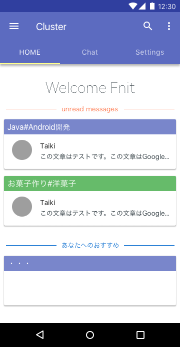
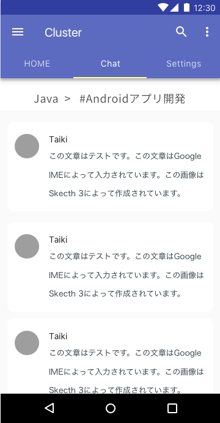
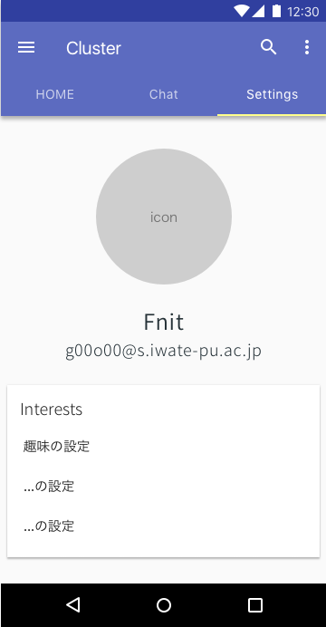
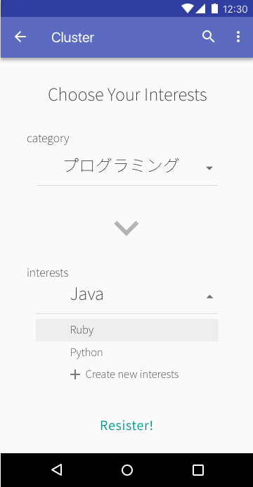

# 学内向けコミュニティー生成アプリ - Cluster(仮)

---

## 概要・目的
学内向けのコミュニティー生成アプリ(SNS)。  
同じ趣味を持つ人同士でのコミュニケーションの場、イベントの企画・参加者募集等の場を提供することを目的とする。

---

## 利用シーン
* 同じ趣味の人同士のマッチング
* 仲間探し
* 学内のイベントの立ち上げ、参加者の募集等 (イベント, 勉強会等の参加者募集やソフトウェア開発における仲間の募集、さらにはゲームのフレンド募集など幅広い範囲での利用を想定)

---

## Target User
* 学内の学生、教員

---

## 機能
* 興味(趣味)をグループとするチャット機能
* 同じような興味(趣味)を持つ人同士のマッチング機能
* イベントの募集ができる掲示板的な機能?

---

## イメージ画像
### HOME画面 イメージ案1

---

### Chat画面 イメージ案1

---

### Settings画面 イメージ案1

---

### HOME画面 イメージ案1

